# Description

**Last updated**  
March 31st, 2020

## Welcome

CHESSAGON® is like traditional Chess, but with Triangles! Highlighted possible moves makes it easy to learn the rules. Play the computer or a friend, or auto-match another player online today with your iOS mobile device!

## Brief Overview
CHESSAGON® is a chess variant based on a hexagonal board of dark and light triangles. It has all the standard chess pieces you would expect: King, Queen, Knight Bishop, Rook, and Pawn; plus a new piece called the Duke. The rules adhere to a purist interpretation of traditional Chess rules, but on a hexagonal board of 96 triangles instead of 64 squares; with the pieces moving on six axes instead of four. The Duke is similar to a Bishop or a Rook in that it is able to move in straight lines across the board. The Knight can move to any of 12 spaces. The Queen moves like a combination of the Duke, the Bishop, and the Rook. The King can move one space in any of 12 directions. The number of pawns has been increased to create an appropriate wall of pawns protecting each side.

 

With possible moves highlighted at each turn, it is easy to learn the game. There is also a help tutorial within the game to describe and demonstrate the way each piece moves and captures.

 

The game includes multiple modes of play, including:

* Single Player vs the Computer
* Local Two-Player
* Online Two-Player

 
Online players are ranked according to the Glicko rating system.

## Free Piece Sets and Boards
This latest version of CHESSAGON® doubled the number of free Piece Sets (Alice, Iconic, Plubmline, Signet) and Boards (Bamboo, Furnace, Sandstone, Slate) now available. Allows for a default of 16 total combinations of boards and piece sets to choose from for game play.  Shown below are 4 of the 16 possible Free combinations.

### Alice Piece Set on Bamboo Board
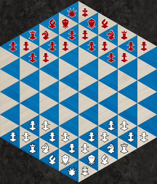

### Iconic Piece Set on Furnace Board
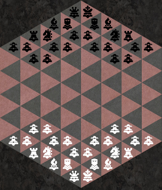

### Plumbline Piece Set on Sandstone Board
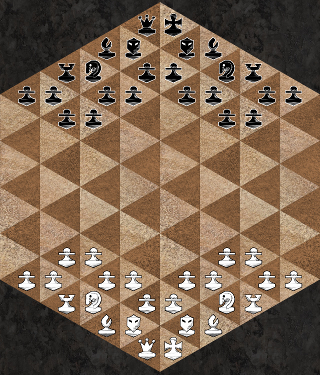

### Signet Piece Set on Slate Board
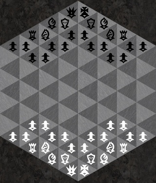

## In-App Purchasable Piece Sets and Boards
This latest version of CHESSAGON® has greatly reduced the price for In-App purchase Piece Sets and Board bundles. Shown below are 8 of the 64 possible new In-App purchase combinations. Using Free and In-App purchase combinations together allows for a maximum total of 144 (12x12) combinations of piece sets and boards  to choose from for game play.

### Classic Piece Set on Maple Board
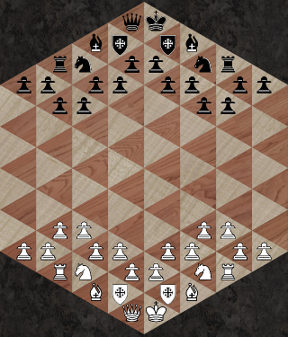

### Keystone Piece Set on Marble Board
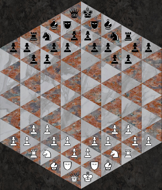

### Newline Piece Set on Tropic Board
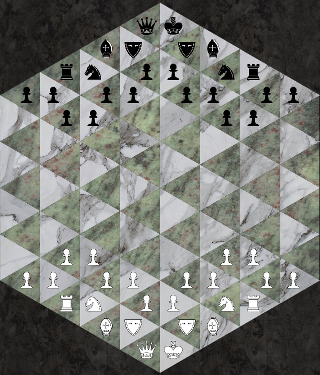

### Outline Piece Set on Cork Board
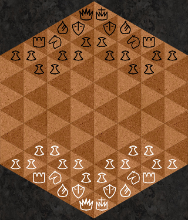

### Ducal Piece Set on Metal Board
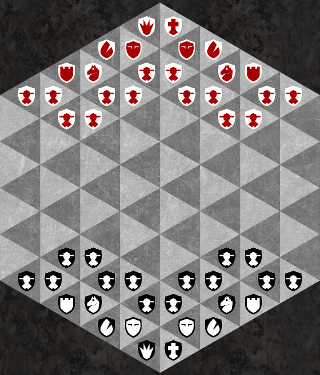

### HexHeads Piece Set on Picnic Board
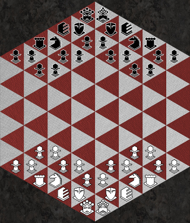

### Isometric Piece Set on Quiche Board
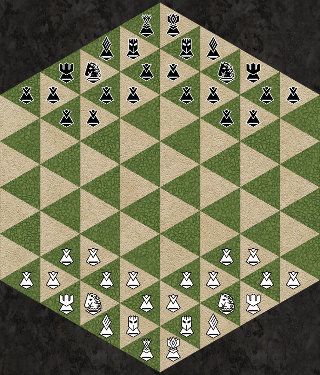

### Snowmen Piece Set on Frost Board
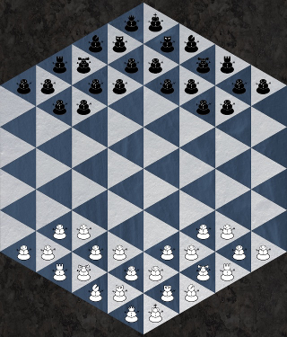
