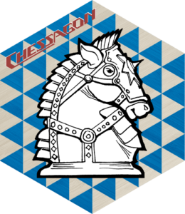
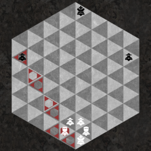

# Chessagon Rules

**Last updated**  
March 31st, 2020

 
  

## Overview

Chessagon is a chess variant based on a hexagonal board of dark and light triangles. It has all the standard chess pieces you would expect: King, Queen, Knight Bishop, Rook, and Pawn; plus a new piece called the Duke. The rules adhere to a purist interpretation of traditional Chess rules, but on a hexagonal board of 96 triangles instead of 64 squares; with the pieces moving on six axes instead of four. The Duke is similar to a Bishop or a Rook in that it is able to move in straight lines across the board. The Knight can move to any of 12 spaces. The Queen moves like a combination of the Duke, the Bishop, and the Rook. The King can move one space in any of 12 directions. The number of pawns has been increased to create an appropriate wall of pawns protecting each side.  A 1:2 ratio of pieces to board spaces is maintained like traditional Chess.  Chessagon has a 48:96 ratio of pieces to spaces; and traditional Chess has a 32:64 ratio of pieces to spaces.

### Objective

Chessagon is a strategy game for two players.  The game consists of a hexagon shaped board with 96 triangular spaces and 48 playing pieces.  There are seven types of pieces:  King, Queen, Duke, Bishop, Knight, Rook and Pawn.  The object of the game is to maneuver the pieces in such a way that the opponent’s King becomes trapped and cannot escape.  This is called checkmate.

#### Piece Legend

King(K), Queen(Q), Duke(D), Bishop(B), Duke(D), Knight(N), Rook(R), Pawn(P)

#### Setup

To begin the game, the playing pieces are arranged on the board as shown in the diagram.  Note that both the white Queen and the black Queen begin on a dark space.  The player with the white pieces moves first, and the players alternate turns thereafter.

  

## Pieces Movement and Capture

For simplicity in describing the moves, the vertices of the triangular spaces will be referred to as points, and the sides of the triangular spaces will be called faces.  For example, a move may be described as: face-to-face, point-to-point, or points adjacent.  Pieces may also be described as moving along a row (a series of spaces that alternate in color and are arranged in a straight line).  A row (also a rank, file, or a column) can be a series of triangular spaces with:

- face-to-face alignment that alternate in color
- alternating point-to-point and then face-to-face alignment that alternate in color
- points adjacent alignment that are all the same color, a "triangular-diagonal" (similar to same color square-diagonals on square chess boards)

All captures are made by landing on a space occupied by an opponent’s piece and removing the opponent’s piece from the board. For each piece movement and capture section below, all piece movements and potential captures are marked with red highlighted triangles in the pictured diagrams.

### Bishop 

#### Movement

The Bishop moves on same color spaces along straight columns and rows in any of six directions, and must remain on its original color.  The Bishop that begins the game on a dark space, must remain on dark spaces for the duration of the game.  The dark Bishop moves along a row in a straight line of dark spaces with points adjacent to its current position, unless blocked by another piece.  If another piece is on a light space, the Bishop is not blocked and can proceed past that piece.  The light Bishop moves in the same manner on the light spaces.

#### Capture

The Bishop captures on same color spaces along straight columns and rows in any of six directions.  For example, the Bishop that begins the game on a dark space can only capture an opponent’s piece residing on a dark space.  A Bishop captures pieces along the path that it travels on the board. The light Bishop captures in the same manner on the light spaces.

### Rook 

#### Movement

The Rook moves face-to-face along straight columns and rows in any of six directions along three different axes, as long as it is not blocked by another piece.

#### Capture

The Rook captures in the same way that it moves. It can stop on a space of either color, capturing any opponent’s piece that is there.

### Duke 

#### Movement

The Duke moves any number of spaces face-to-face then point-to-point in a straight line, in any of six directions along three axes, unless blocked by another piece.

#### Capture

The Duke captures in the same way that it moves.  It can stop on a space of either color, capturing any opponent’s piece that is there.

### Queen 

#### Movement

The Queen is the most powerful piece.  It can move any number of spaces in any way that a Duke, a Rook, or a Bishop can move; as long as it is not blocked by another piece.

#### Capture

The Queen also captures in the same manner as the Duke, the Rook, or the Bishop.  It can stop on a space of either color, capturing any opponent’s piece that is there.

### Knight 

#### Movement

The Knight jumps to one of twelve spaces of the opposite color, just beyond the triangle of spaces that surrounds it.  The Knight is the only piece that can jump over other pieces on the board.  It always moves to a space of the opposite color than it currently occupies.

#### Capture

The Knight captures in the same way that it moves. It always captures to a space of the opposite color than it currently occupies, capturing any opponent’s piece that is there.

#### Beyond The Queen

The Knight is the only piece that can position itself beyond the reach and threat of a Queen, but still capture the Queen. The ability of the knight to jump over over pieces and have an extended reach keeps the power of the Queen in check.

### King 

#### Movement

The King can move one space in any of twelve directions.  The King can move one space face-to-face, one space point-to-point, or one space with points adjacent to the King’s current position. The King may never move into check, which is any space currently vulnerable to attack by an opponent’s piece.

#### Capture

The King captures in the same way that it moves.  If the King is in check, it must be moved out of check before any other move can be made.   There are three ways to accomplish this:

1) move the King to another space

2) block the attack with another piece

3) capture the attacking piece

If the King cannot be taken out of check in a single move, the King is considered to be in checkmate; and the game is over.

#### Castling

The King can make a castling move, which must be at least one space further than it normally moves, and involves repositioning a Rook to the opposite side of the King.  Neither the King nor the Rook may have been previously moved during the course of the game.  The King may castle either toward the Rook on the left or the Rook on the right.  There  cannot be any piece(s) of either color between the King and the Rook in order for castling to take place.  Each player may only castle once during a game.  The King may not castle out of check or through check.

### Pawn 

#### Opening Movement

The Pawn can move two spaces forward point-to-point then face-to-face, or two spaces forward face-to-face then point-to-point on its opening move.

#### Regular Movement

The Pawn moves forward one space to a space of the opposite color, point-to-point or face- to-face from its current position.  It cannot move laterally or backward.  Other than the Pawn’s first move of the game, it usually has a choice of two spaces to which it can move at any one time.

#### Regular Capture

The Pawn captures an opponent’s piece by moving forward to a space of the same color, with points adjacent to its current space.  Other than the En Passant capture, it usually has three spaces to which it can capture at any one time.

#### En Passant Capture

A special way that a Pawn can capture is called En Passant.  This type of capture occurs when one Pawn is moved two spaces forward, in an attempt to avoid capture by the opponent’s Pawn.  The fleeing Pawn is captured by the opponent’s Pawn the same as if the player had moved the fleeing Pawn only one space forward.

#### Rank Promotion

If a Pawn advances all the way across the board to any one of the eight spaces at the back edge of the opponent’s side of the board, that Pawn is immediately promoted to a Queen.  If this occurs, it is possible for a player to have more than one Queen.

  
 
  

CHESSAGON® Concept and Rules

© 1977-2020

All Rights Reserved by

- Kerry Langford
- Eric Langford
- Debra Langford
 